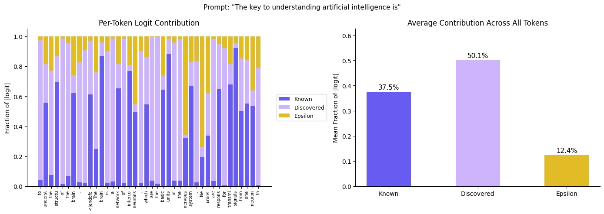

# Steerling
[](https://pypi.org/project/steerling/)
[](LICENSE)
[](https://pypi.org/project/steerling/)
[](https://huggingface.co/guidelabs/steerling-8b)
[](https://github.com/astral-sh/ruff)
[](https://github.com/pre-commit/pre-commit)

An interpretable causal diffusion language model.

Steerling-8B combines masked diffusion language modeling with concept decomposition, enabling:
- **Generation**: Non-autoregressive text generation via confidence-based unmasking
- **Attribution**: Decompose predictions into known concept contributions
- **Steering**: Intervene on concept activations to control generation
- **Embeddings**: Extract hidden, composed, known, or discovered representations

For more information, tutorials, and updates, visit [guidelabs.ai](https://www.guidelabs.ai). To learn more about the architecture behind Steerling, check out our blog posts on [Scaling Interpretable Models with 8B Parameters](https://www.guidelabs.ai/post/scaling-interpretable-models-8b/) and [Causal Diffusion Language Models](https://www.guidelabs.ai/post/block-causal-diffusion-language-model/).

## Quick Start

```bash
uv venv && source .venv/bin/activate
uv pip install steerling
```

```python
import torch
from transformers import AutoModel, AutoTokenizer
from steerling import SteerlingGenerator, GenerationConfig

model_id = "guidelabs/steerling-8b"
model = AutoModel.from_pretrained(model_id, trust_remote_code=True, dtype=torch.bfloat16)
tokenizer = AutoTokenizer.from_pretrained(model_id, trust_remote_code=True)
generator = SteerlingGenerator.from_model(model, tokenizer, device="cuda")

prompt = "The key to understanding neural networks is"
config = GenerationConfig(max_new_tokens=128, steps=128)
text = generator.generate(prompt, config)
print(text)
```

**Requirements:** Python >= 3.13, GPU with >= 18 GB VRAM (H100, A100, A6000, RTX 4090), CUDA 12.8

## Model Details

| Property | Value |
|---|---|
| Parameters | ~8B |
| Architecture | CausalDiffusionLM + Interpretable Concept Head |
| Context Length | 4096 |
| Vocabulary | 100,281 (cl100k_base + specials) |
| Known Concepts | 33,732 |
| Discovered Concepts | 101,196 |
| GQA | 32 heads, 4 KV heads |
| Precision | bfloat16 |

## Architecture

Steerling uses block-causal attention (bidirectional within 64-token blocks, causal across blocks) with masked diffusion training. At inference, tokens are generated by iteratively unmasking positions in order of model confidence. The interpretable concept heads decompose transformer hidden states `h` into:

```
h → known_features + unk_hat + epsilon = composed → lm_head → logits
```

<p align="center">
  
</p>

- `known_features`: Weighted sum of top-k learned concept embeddings
- `unk_hat`: Residual features captured by a factorized discovered concept head
- `epsilon`: Small correction term for reconstruction fidelity

## Interpretability

Every prediction Steerling makes can be decomposed into three components: **known concepts** (human-interpretable features), **discovered concepts** (learned residual features), and **epsilon** (reconstruction correction). The plot below shows the fraction of each token's logit attributable to each component:

<p align="center">
  
</p>

See [logit_contribution.ipynb](notebooks/base_model/logit_contribution.ipynb) for per-token decomposition and [chunk_level_concept_attribution.ipynb](notebooks/base_model/chunk_level_concept_attribution.ipynb) for chunk-level concept attribution.

## Installation

```bash
# From PyPI
uv venv && source .venv/bin/activate
uv pip install steerling

# From PyPI with notebook dependencies (matplotlib, jupyter, etc.)
uv pip install steerling[notebook]

# From source
git clone https://github.com/guidelabs/steerling.git
cd steerling
uv sync --extra notebook    # for running notebooks
uv sync --extra dev         # full dev environment (tests, linting, notebooks)
source .venv/bin/activate
```

**Note:** PyTorch is installed with CUDA 12.8 support automatically via the PyTorch index configured in `pyproject.toml`. If you need a different CUDA version, install PyTorch manually before installing steerling.

## Evaluation

We provide evaluation scripts based on [lm-evaluation-harness](https://github.com/EleutherAI/lm-evaluation-harness).

```bash
# Run all benchmarks (HellaSwag, ARC-Challenge, WinoGrande, PIQA, MMLU, GSM8K)
bash scripts/eval_steerling_lm_eval.sh

# Specify a model path
MODEL_PATH=/path/to/local/model bash scripts/eval_steerling_lm_eval.sh

# Run specific tasks
TASKS="hellaswag arc_challenge" bash scripts/eval_steerling_lm_eval.sh

# Or use the Python CLI directly
python scripts/evaluate.py --model guidelabs/steerling-8b --tasks hellaswag arc_challenge
```

## Notebooks

We provide notebooks for generation, logit contribution decomposition, chunk-level concept attribution, and concept steering (amplification and suppression). Each notebook is available in two versions:

- [`notebooks/base_model/`](notebooks/base_model/) — Base model (`guidelabs/steerling-8b`)
- [`notebooks/instruct_model/`](notebooks/instruct_model/) — Instruct model (`guidelabs/steerling-8b-instruct`)

There is also a [search_concepts.ipynb](notebooks/search_concepts.ipynb) notebook for browsing the concept vocabulary. Concept labels are in `assets/concepts/concept_labels.parquet`.

## FAQ

- **Where can I read more about the architecture?**\
  See our blog posts: [Scaling Interpretable Models with 8B Parameters](https://www.guidelabs.ai/post/scaling-interpretable-models-8b/) and [Causal Diffusion Language Models](https://www.guidelabs.ai/post/block-causal-diffusion-language-model/). A detailed technical report is coming soon.

- **Is there an instruction-tuned model?**\
  Yes — [guidelabs/steerling-8b-instruct](https://huggingface.co/guidelabs/steerling-8b-instruct). See the instruct notebooks above for usage.

- **What dataset was this trained on?**\
  An augmented version of the Nemotron-CC-HQ dataset for approximately 1.35 trillion tokens.

- **What is block-causal attention?**\
  Standard causal attention only lets each token attend to previous tokens. Block-causal attention groups tokens into blocks of 64 and allows bidirectional attention within each block, while maintaining causal ordering across blocks. See [Causal Diffusion Language Models](https://www.guidelabs.ai/post/block-causal-diffusion-language-model/) for more details.

- **What are "known" and "discovered" concepts?**\
  The model decomposes its internal representations into two parts:
  - *Known concepts* (33,732): learned, supervised features corresponding to identifiable patterns a human can understand.
  - *Discovered concepts* (101,196): capture the signal that known concepts don't explain.
  - Together they reconstruct the full hidden state: `hidden ≈ known_features + discovered_features + epsilon`.

- **How do I find concept IDs for steering?**\
  Use [search_concepts.ipynb](notebooks/search_concepts.ipynb) to browse and search concept names.

- **What GPU do I need?**\
  Steerling-8B in bfloat16 requires approximately 18 GB VRAM. It fits on a single H100, A100 (40GB or 80GB), A6000 (48GB), or RTX 4090 (24GB).

- **Can I fine-tune this model?**\
  Yes, but fine-tuning code is not included in this release. If there is sufficient interest, we will support it in a future release.

- **What tokenizer does Steerling-8B use?**\
  OpenAI's `cl100k_base` tokenizer (via tiktoken) with 4 additional special tokens: `<|pad|>`, `<|bos|>`, `<|endofchunk|>`, and `<|mask|>`, for a total vocabulary of 100,281 tokens.

- **How do I get training data attributions?**\
  This release supports concept and feature attributions via the provided notebooks. Training data attribution is not currently supported but will be added in a future release.

## License

The Steerling source code is released under the [Apache License 2.0](LICENSE).

The model weights are provided for research and evaluation purposes. The weights were trained on datasets with varying license terms, including [Nemotron-CC-HQ](https://huggingface.co/datasets/nvidia/Nemotron-CC) and [Dolmino Mix](https://huggingface.co/datasets/allenai/dolmino-mix-1124). Some training data includes synthetic content generated by third-party models with their own license terms. We are currently reviewing the implications of these upstream licenses for downstream use of the model weights. Please check back for updates.

For questions about commercial use of the model weights, contact us at info@guidelabs.ai.

## Citation

Full details are available in our paper: [Scaling Inherently Interpretable Language Models](https://www.guidelabs.ai/papers/scaling-inherently-interpretable-language-models.pdf).

If you used this repository or our models, please cite our work:

```bibtex
@article{guidelabs2026steerling,
  title={Scaling Inherently Interpretable Language Models},
  author={{Guide Labs Team}: Madsen, Andreas and Ismail, Aya Abdelsalam and Nguyen, Giang and Plant, Isaac and Chaudhary, Muawiz and Monson, Nathaniel and Azim, Saqib and Guo, Zhichen and Adebayo, Julius},
  year={2026},
  url={https://www.guidelabs.ai/papers/scaling-inherently-interpretable-language-models.pdf}
}
```
